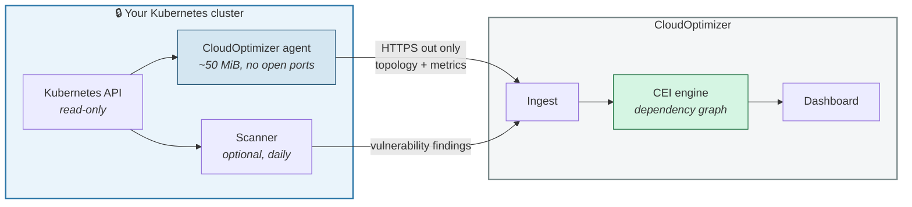
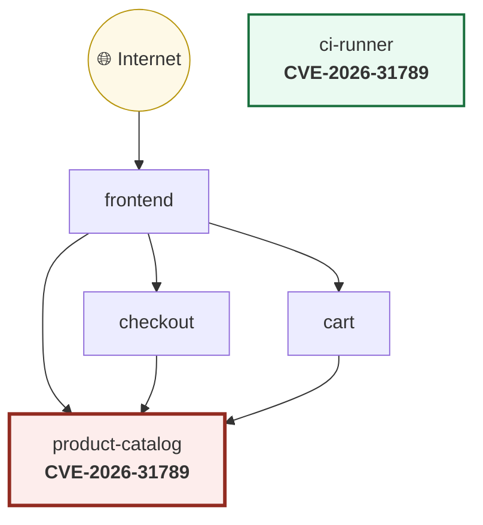
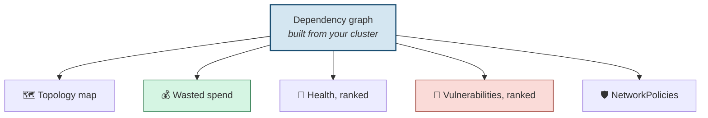
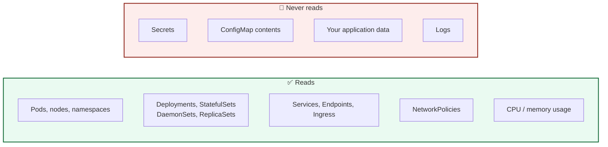
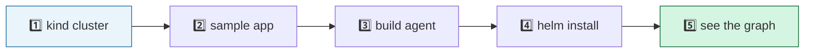
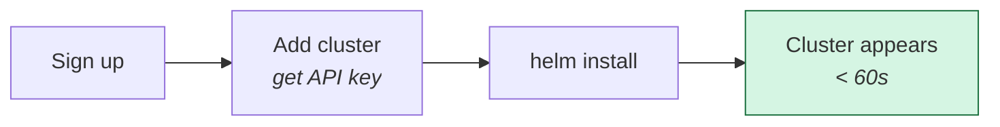

# CloudOptimizer — Getting Started

**Find the 5 things in your cluster that actually matter.**

Your cluster already tells you plenty. A vulnerability scanner gives you 400
criticals. A cost tool gives you a spreadsheet. A monitoring dashboard gives
you 200 alerts. None of them tell you which ones matter, because none of them
know what depends on what.

CloudOptimizer builds a dependency graph of your cluster and ranks everything
against it.

---

## Contents

1. [What this is](#1-what-this-is)
2. [Why ranking changes the answer](#2-why-ranking-changes-the-answer)
3. [What you get](#3-what-you-get)
4. [What the agent can and cannot see](#4-what-the-agent-can-and-cannot-see)
5. [Try it locally in 10 minutes](#5-try-it-locally-in-10-minutes)
6. [Install on a real cluster](#6-install-on-a-real-cluster)
7. [Configuration](#7-configuration)
8. [Troubleshooting](#8-troubleshooting)
9. [What is not built yet](#9-what-is-not-built-yet)

---

## 1. What this is

A read-only agent runs in your cluster. It reports the shape of your
infrastructure — what runs, what calls what, what it costs, and what is
failing. The dashboard ranks everything by **blast radius**: how much breaks
if a given workload fails.



One `helm install`. Works the same on EKS, AKS, and GKE. Nothing is written
to your cluster — the agent's permissions are `get`, `list`, and `watch`.

---

## 2. Why ranking changes the answer

Here is the whole idea in one picture. Two workloads, **the same CVE**, same
CVSS score:



| | product-catalog | ci-runner |
|---|---|---|
| CVE | CVE-2026-31789 | CVE-2026-31789 |
| CVSS | 9.8 | 9.8 |
| Depended on by | frontend, checkout, cart | nothing |
| Reachable from internet | yes | no |
| **CloudOptimizer priority** | **13.34** | **5.50** |

A scanner sorted by severity puts these next to each other. One of them takes
your checkout flow down; the other one doesn't. That 2.4× difference is
measured, not estimated — it comes from the graph.

The same ranking drives everything else: which crash loop pages you at 3am,
which unsegmented workload matters, which upgrade is safe to automate.

---

## 3. What you get



**🗺️ Topology map** — every workload and every dependency, coloured and sized
by blast radius. Usually the first time anyone sees the real shape of the
cluster.

**💰 Wasted spend, in dollars** — requested versus actually used, priced
against your node types. Reserved-but-unused capacity is money you are
already paying for. Reported separately from *unallocated* node capacity,
because those are different problems: one is "shrink your requests", the other
is "shrink your node pool".

> Cost figures are list-price estimates. Your invoice reflects Reserved
> Instances, Savings Plans, and committed-use discounts — commonly 20–70%
> below list. Use these to rank opportunities, not to reconcile a bill.

**🚨 Health, ranked** — CrashLoopBackOff, OOMKills, unschedulable pods, image
pull failures, single-replica services that other things depend on. Every
dashboard lists these. Ordering them by what depends on the workload is the
part that saves you time.

**🔐 Vulnerabilities, ranked** — optional daily Trivy scan of running images.
Ranked by severity **×** blast radius **×** internet reachability **×**
whether a fix exists.

**🛡️ NetworkPolicy generation** — least-privilege policies derived from
dependencies actually observed, always including DNS egress (the thing
hand-written policies forget). Audit-first: review before enforcing.

---

## 4. What the agent can and cannot see

This matters more than any feature, so it is stated plainly.



**Secrets and ConfigMaps are not in the RBAC role at all.** The agent cannot
request them — that is enforced by Kubernetes, not by our code being polite.
Read the ClusterRole yourself before installing:

```bash
helm template cloudoptimizer ./charts/cloudoptimizer-agent \
  --set apiKey=placeholder | grep -A40 "kind: ClusterRole"
```

### The environment variable question

To work out that `frontend` calls `cart-api`, the agent reads container
environment variables — which is also where people put database passwords.

**Those values never leave your cluster.** They are parsed in-process, the
service references are extracted, and the values are discarded. Only the
resulting edges are transmitted. A value is emitted only if it resolves to a
Service that actually exists, so a password shaped like a hostname still
cannot escape.

Variable *names* that look credential-bearing (`DB_PASSWORD`, `STRIPE_KEY`)
are reported as `<redacted>`.

**Verify it yourself** — this prints the exact payload without sending
anything:

```bash
kubectl -n cloudoptimizer exec deploy/cloudoptimizer-cloudoptimizer-agent -- \
  python -m cloudoptimizer_agent --dry-run
```

---

## 5. Try it locally in 10 minutes

Nothing touches your real infrastructure. You need **Docker**, **kind**,
**kubectl**, and **helm**.



### 1. Create a throwaway cluster

```bash
kind create cluster --name cloudoptimizer-trial
```

### 2. Install something worth looking at

Google's Online Boutique — 11 microservices with real dependencies:

```bash
kubectl apply -f https://raw.githubusercontent.com/GoogleCloudPlatform/microservices-demo/v0.10.2/release/kubernetes-manifests.yaml
kubectl wait --for=condition=available --timeout=300s deployment --all
```

Add metrics-server so you get real CPU numbers rather than just requests:

```bash
kubectl apply -f https://github.com/kubernetes-sigs/metrics-server/releases/latest/download/components.yaml
kubectl patch -n kube-system deployment metrics-server --type=json \
  -p='[{"op":"add","path":"/spec/template/spec/containers/0/args/-","value":"--kubelet-insecure-tls"}]'
```

> `--kubelet-insecure-tls` is needed for kind only. Never use it on a real
> cluster.

### 3. Build the agent

The published image is not available yet (see
[§9](#9-what-is-not-built-yet)), so build it locally:

```bash
git clone https://github.com/prawalpokharel/CEI-Cloud-Governance-Framework
cd CEI-Cloud-Governance-Framework/agent
docker build -t cloudoptimizer-agent:0.1.0 .
kind load docker-image cloudoptimizer-agent:0.1.0 --name cloudoptimizer-trial
```

### 4. See what it would send — before installing anything

```bash
cd agent
python3 -m venv .venv && .venv/bin/pip install -r requirements.txt
.venv/bin/python -m cloudoptimizer_agent --dry-run
```

You get a full payload printed to your terminal. Search it for a password from
your own manifests — it will not be there.

### 5. Install

Register a cluster in the dashboard to get an API key, then:

```bash
helm install cloudoptimizer ./charts/cloudoptimizer-agent \
  --namespace cloudoptimizer --create-namespace \
  --set apiKey=co_live_xxxxx \
  --set image.repository=cloudoptimizer-agent \
  --set image.tag=0.1.0 \
  --set image.pullPolicy=Never
```

Watch it connect:

```bash
kubectl -n cloudoptimizer logs -f deploy/cloudoptimizer-cloudoptimizer-agent
```

You should see, within a minute:

```
Kubernetes credentials loaded from in-cluster
Collected seq=1: 1 nodes, 18 workloads, 15 services, 23 pods,
                 16 edges ({'env_reference': 16}), 28.6 KiB, metrics=yes
Ingested seq=1: cluster=f6e21c3a-…
```

**16 edges** is the number to look for — the agent found every documented
dependency in Online Boutique without a service mesh.

### Tear down

```bash
kind delete cluster --name cloudoptimizer-trial
```

---

## 6. Install on a real cluster

Same chart, three settings changed.



### Before you start

| Requirement | Why |
|---|---|
| Kubernetes 1.24+ | Tested on 1.29 |
| Outbound HTTPS | The agent makes outbound calls only; no inbound ports |
| Permission to create a ClusterRole | It is read-only, and you can read it first |
| metrics-server *(recommended)* | Without it, usage is unknown and cost analysis is limited to requested capacity |

> **EKS ships without metrics-server.** AKS and GKE include it. On EKS,
> install it or your waste figures will be based on requests alone.

### Install

```bash
helm install cloudoptimizer ./charts/cloudoptimizer-agent \
  --namespace cloudoptimizer --create-namespace \
  --set apiKey=co_live_xxxxx
```

**Prefer not to put a key on the command line?** Passing `--set apiKey=…`
records it in Helm's release history. For production, create the Secret
yourself:

```bash
kubectl create namespace cloudoptimizer
kubectl -n cloudoptimizer create secret generic cloudoptimizer-key \
  --from-literal=api-key=co_live_xxxxx

helm install cloudoptimizer ./charts/cloudoptimizer-agent \
  --namespace cloudoptimizer \
  --set existingSecret=cloudoptimizer-key
```

### Start with one namespace

Perfectly reasonable for a first install:

```bash
helm install cloudoptimizer ./charts/cloudoptimizer-agent \
  --namespace cloudoptimizer --create-namespace \
  --set apiKey=co_live_xxxxx \
  --set 'namespaces={staging}'
```

### Optional: enable vulnerability scanning

Off by default. It runs as a **separate CronJob**, not inside the agent — a
scanner needs to pull images (registry credentials, ~1 GiB vulnerability
database), and keeping that apart preserves the agent's small, read-only
footprint.

```bash
helm upgrade cloudoptimizer ./charts/cloudoptimizer-agent \
  --namespace cloudoptimizer --reuse-values \
  --set scanner.enabled=true
```

Images are pulled and scanned **inside your cluster**, using the registry
access it already has. Only findings leave. Registry credentials never do.

### Uninstall

```bash
helm uninstall cloudoptimizer -n cloudoptimizer
kubectl delete namespace cloudoptimizer
```

Nothing is left behind. The agent never wrote anything to your cluster.

---

## 7. Configuration

| Value | Default | What it does |
|---|---|---|
| `apiKey` | — | Agent credential from the dashboard |
| `existingSecret` | `""` | Use a Secret you manage instead of `apiKey` |
| `endpoint` | `https://api.cloudoptimizer.app` | Where snapshots are sent |
| `intervalSeconds` | `60` | Seconds between snapshots |
| `namespaces` | `[]` *(all)* | Restrict collection |
| `excludeNamespaces` | `[]` | Never collect from these |
| `collectMetrics` | `true` | Read CPU/memory from metrics-server |
| `scanner.enabled` | `false` | Vulnerability scanning CronJob |
| `scanner.schedule` | `0 3 * * *` | Daily, off-peak |
| `resources` | 50m / 128Mi request | Agent footprint |

The agent runs as **UID 10001, non-root, read-only root filesystem, all
capabilities dropped, no listening ports**.

---

## 8. Troubleshooting

<details>
<summary><b>Cluster shows "waiting for agent"</b></summary>

```bash
kubectl -n cloudoptimizer logs deploy/cloudoptimizer-cloudoptimizer-agent
```

- `Invalid API key` — the key was revoked, or belongs to a different cluster
- `already registered as '<name>'` — this physical cluster is already
  registered under another name. Use that cluster's key, or delete it first.
- Connection timeouts — egress to the endpoint is blocked
</details>

<details>
<summary><b>metrics=no in the logs</b></summary>

metrics-server is missing or unreachable. Topology still works; usage and cost
figures do not.

```bash
kubectl top nodes    # fails the same way if metrics-server is unhealthy
```
</details>

<details>
<summary><b>Zero edges found</b></summary>

Dependencies are inferred from Service selectors, Ingress backends, and
service references in container environment variables. Applications that
resolve dependencies at runtime — a hostname from a database, a hardcoded IP
— produce no edge.

Not a failure, but it does mean the graph is incomplete, and anything derived
from it (rankings, generated NetworkPolicies) inherits that.
</details>

<details>
<summary><b>Cluster shows "stale"</b></summary>

Nothing reported for over three minutes. The pod was evicted, OOMKilled, or
lost egress.

```bash
kubectl -n cloudoptimizer get pods
kubectl -n cloudoptimizer describe pod -l app.kubernetes.io/name=cloudoptimizer-agent
```
</details>

<details>
<summary><b>Scanner CronJob never runs</b></summary>

Check the schedule and whether a previous run is still going —
`concurrencyPolicy: Forbid` skips overlapping runs by design.

```bash
kubectl -n cloudoptimizer get cronjob,jobs
```
</details>

---

## 9. What is not built yet

Stated plainly, because a getting-started guide that overpromises wastes your
afternoon.

| | Status |
|---|---|
| Published container images | **Not yet.** Build locally (§5.3). |
| Egress traffic analysis | Needs eBPF or a service mesh. Dependencies come from declarations, not packet capture. |
| CSPM (public buckets, IAM) | Needs cloud account connection. Not implemented. |
| Log collection | Not started. |
| SAST | Not started. |
| Automated fix PRs | Built and tested; requires a GitHub App and is opt-in per repository. |
| Writing to your cluster | **Not implemented at all.** The agent is read-only and has no write permissions. CloudOptimizer *acts* by opening pull requests in your repository through the GitHub App — changes you review and merge, never changes applied to the cluster behind your back. |

Multi-cloud validation on EKS, AKS, and GKE has a runbook
([`VALIDATION.md`](VALIDATION.md)) but has not been executed. Everything above
is verified on kind against a real workload.

---

## Questions worth asking us

- *Does it work with a service mesh?* Istio and Linkerd sidecars are visible
  as workloads. Mesh telemetry is not consumed yet.
- *What about Windows nodes?* Untested.
- *Air-gapped?* The agent needs outbound HTTPS to the ingest endpoint. There
  is no on-prem mode today.
- *How much does the agent cost to run?* Requests 50m CPU / 128Mi. Steady
  state on a 20-workload cluster is about 50 MiB and negligible CPU.

---

<sub>CloudOptimizer · CEI framework · USPTO App. No. 19/641,446</sub>
